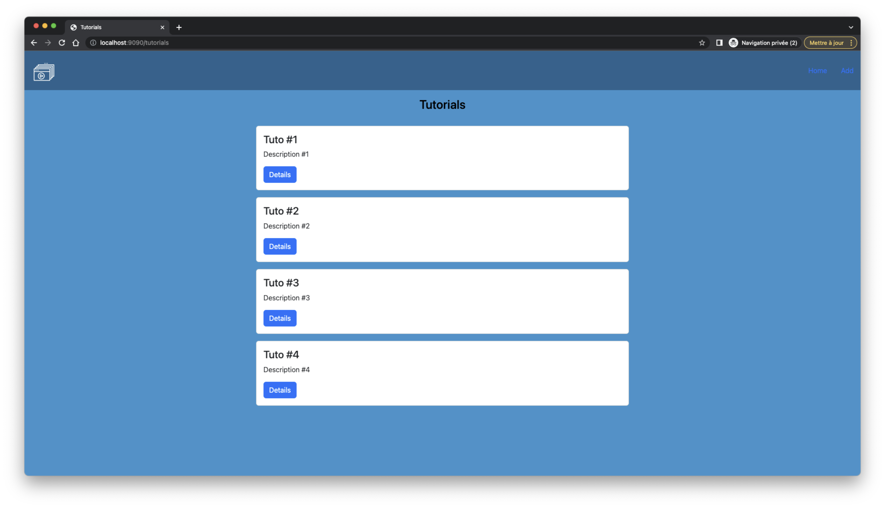
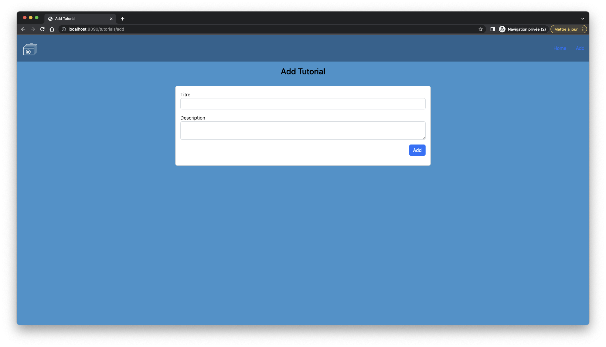
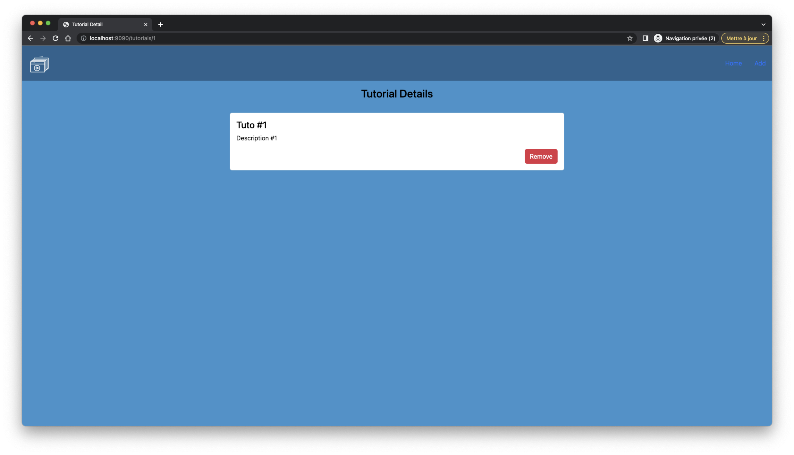

# Projet Tutorials

Simple projet effectuant un CRUD sur une entitée Game
Deux URLS sont disponibles :
- http://localhost:9090/tutorials
- http://localhost:9090/api/tutorials

Peut-etre utilisé par le frontend Angular suivant : https://github.com/sauvageb/Angular_Tutorials

# Technologies

- Spring Boot 3.0.0
- Spring Data JPA
- Spring Dev Tools

- Spring MVC
- Tomcat Embed Jasper (Activation du support JSP sur Spring)
- JSTL 2.0

- Connector J
- Mysql (8.0.31)

# Aperçus

##### Liste des tutoriels :

##### Ajout d'un tutoriel :

##### Détails d'un tutoriel :

